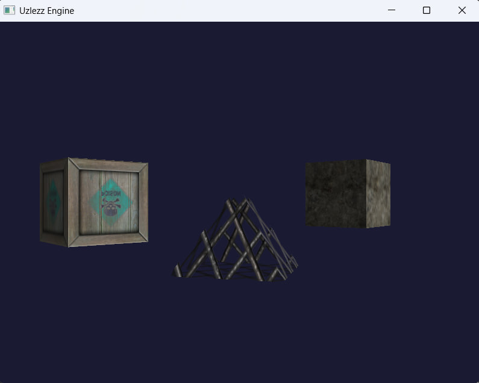

# ITMO Uzlezz Engine

Практическая работа по курсу "Школа разработки компьютерных игр ИТМО, 2026".

Текущее состояние репозитория соответствует ПЗ3: менеджер ресурсов, загрузка моделей, текстур и шейдеров, интеграция с ECS и демонстрационная 3D-сцена.

## Стек

- C++17
- OpenGL 3.3
- GLFW
- GLAD
- Assimp
- stb_image
- nlohmann/json
- CMake

## Реализовано

- `Application` с игровым циклом и `deltaTime`
- система состояний `LoadingState -> MenuState -> GameplayState`
- ECS: `World`, `Entity`, `Component`, `System`
- `ResourceManager` с кэшированием `Mesh`, `Texture`, `Shader`
- шаблонный интерфейс `load<T>()`
- загрузка `obj`-моделей через Assimp
- загрузка текстур через `stb_image` и поддержка `DDS DXT1/DXT5`
- компиляция и кэширование шейдерных программ
- расширенный `RenderAdapter` для GPU-ресурсов
- `MeshRenderer`, использующий идентификаторы и ссылки на ресурсы
- `RenderSystem`, рисующий загруженные меши и текстуры через ECS
- JSON-манифест сцены
- hot reload шейдеров по изменению файлов

## Демонстрационная сцена

Сцена описана в [assets/scenes/demo_scene.json](assets/scenes/demo_scene.json).

В ней используются:

- две сущности с общим мешем куба
- одна сущность с пирамидой
- текстуры `WoodCrate02.dds`, `stone.dds`, `WireFence.dds`
- общий базовый текстурный шейдер
- разные трансформации и автоматическое вращение

## Управление

- `Enter` - переход из меню в игровую сцену
- `Стрелки` - перемещение управляемого объекта
- `ЛКМ` - увеличить масштаб
- `СКМ` - уменьшить масштаб
- `ПКМ` - повернуть объект

## Сборка

### Visual Studio

Открыть папку проекта как CMake-проект и собрать конфигурацию `x64-Debug` или `x64-Release`.

### Через CMake

```powershell
cmake -B build
cmake --build build --config Release
```

После сборки `assets` автоматически копируются рядом с исполняемым файлом.

## Запуск

Пример для `Release`:

```powershell
.\build\Release\GameEngine.exe
```

Пример для Visual Studio runtime-каталога:

```powershell
.\out\build\x64-Debug\GameEngine.exe
```

## Скриншоты

### Основная сцена



### Галерея

<table>
  <tr>
    <td align="center">
      
      <br>
      Изменение масштаба
    </td>
    <td align="center">
      
      <br>
      Поворот объекта
    </td>
  </tr>
  <tr>
    <td align="center" colspan="2">
      
      <br>
      Перемещение управляемого объекта
    </td>
  </tr>
</table>
