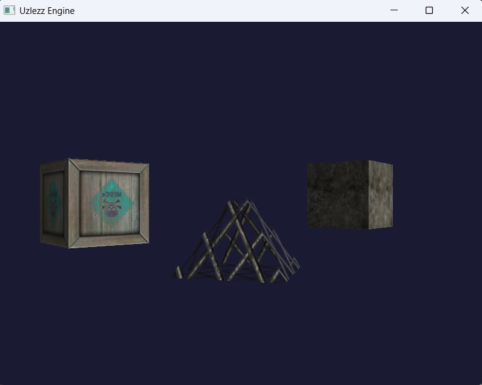

# ITMO Uzlezz Engine

Практическая работа по курсу "Школа разработки компьютерных игр ИТМО, 2026".

Текущее состояние репозитория соответствует ПЗ3: менеджер ресурсов, загрузка моделей, текстур и шейдеров, интеграция с ECS и демонстрационная 3D-сцена.

## Стек

- C++17
- OpenGL 3.3
- GLFW
- GLAD
- Assimp
- stb_image
- nlohmann/json
- CMake

## Реализовано

- `Application` с игровым циклом и `deltaTime`
- система состояний `LoadingState -> MenuState -> GameplayState`
- ECS: `World`, `Entity`, `Component`, `System`
- `ResourceManager` с кэшированием `Mesh`, `Texture`, `Shader`
- шаблонный интерфейс `load<T>()`
- загрузка `obj`-моделей через Assimp
- загрузка текстур через `stb_image` и поддержка `DDS DXT1/DXT5`
- компиляция и кэширование шейдерных программ
- расширенный `RenderAdapter` для GPU-ресурсов
- `MeshRenderer`, использующий идентификаторы и ссылки на ресурсы
- `RenderSystem`, рисующий загруженные меши и текстуры через ECS
- JSON-манифест сцены
- hot reload шейдеров по изменению файлов

## Система координат

Мировая система правосторонняя, с вертикалью Z, как в Blender: **+X — вправо, −Y — вперёд, +Y — назад, +Z — вверх**. Пол лежит в XY, гравитация действует по −Z, прыжок — по +Z. Вращение `Spin` идёт вокруг Z.

Начальная камера находится со стороны −Y и смотрит в сцену по +Y: на таком виде +X идёт вправо, а +Z вверх. Движение камеры вперёд зависит от направления её взгляда. В редакторе `ПКМ + WASD` перемещает камеру по XY, `E/Q` — вверх/вниз по Z; мышь поворачивает её вокруг Z и наклоняет. Управляемый объект движется по мировым осям: `W/↑` — −Y, `S/↓` — +Y, `A/←` — −X, `D/→` — +X.

Демонстрационная сцена переведена на Z-up. Координаты импортированных мешей используются как записаны в файле; модели следует экспортировать в Z-up либо поворачивать в Inspector. Для переноса старых Y-up сцен позиции и векторы преобразуются `(x, y, z) → (x, −z, y)`, размеры — `(sx, sy, sz) → (sx, sz, sy)`; ориентации и геометрия требуют соответствующего поворота на +90° вокруг X. Автоматической миграции сторонних сцен нет.

## Текстуры в редакторе

- PNG, JPEG, BMP и TGA декодируются полной версией `stb_image`; DDS DXT1/DXT5 использует встроенный декодер.
- `Inspector → MeshRenderer → Base Texture` открывает выпадающий список с миниатюрами, именами и папками текстур. Поиск работает по имени и пути; наведение показывает увеличенное превью и разрешение.
- Список обновляется при открытии и рекурсивно собирается из папок проекта (`assets` и других папок с контентом). Служебные папки, зависимости, сборки, тесты и документация пропускаются. Миниатюры загружаются для видимых строк и кэшируются; выбор сразу применяется к объекту.
- `<Material / default>` использует цветовую текстуру материала модели (`map_Kd` в OBJ/MTL или внешнюю base-color карту Assimp). Относительные пути разрешаются от каталога модели. При смене меша на модель с текстурой материала старое переопределение сбрасывается.
- Если цветовая текстура отсутствует или повреждена, основной шейдер использует цвет материала. Ошибка декодирования записывается в лог.
- Обычные изображения переворачиваются по вертикали для UV с началом снизу; прежняя ориентация DDS сохраняется.
- Этот путь применяет базовую цветовую карту. Встроенные в модель изображения и полноценное PBR-освещение пока не реализованы.

Проверка: `ctest --test-dir build -C Release --output-on-failure`. Проверка текстур создаёт скрытый OpenGL-контекст, проверяет реальные пиксели PNG, прозрачность, загрузку PNG/DDS проекта и рендер OBJ с текстурой из MTL. При отсутствии дисплея GLFW этот тест пропускается.

## Демонстрационная сцена

Сцена описана в [assets/scenes/demo_scene.json](assets/scenes/demo_scene.json).

В ней используются:

- две сущности с общим мешем куба
- одна сущность с пирамидой
- текстуры `WoodCrate02.dds`, `stone.dds`, `WireFence.dds`
- общий базовый текстурный шейдер
- разные трансформации и автоматическое вращение

## Управление

- В режиме редактирования, когда viewport активен или курсор находится над ним: `W` — Translate, `E` — Scale, `R` — Rotate. Горячие клавиши не переключают инструмент при вводе текста, открытом меню, перетаскивании или управлении камерой с ПКМ.
- `Enter` - переход из меню в игровую сцену
- `Стрелки` - перемещение управляемого объекта
- `ЛКМ` - увеличить масштаб
- `СКМ` - уменьшить масштаб
- `ПКМ` - повернуть объект

## Сборка

### Visual Studio

Открыть папку проекта как CMake-проект и собрать конфигурацию `x64-Debug` или `x64-Release`.

### Через CMake

```powershell
cmake -B build
cmake --build build --config Release
```

После сборки `assets` автоматически копируются рядом с исполняемым файлом.
DLL Assimp также копируется рядом с EXE при каждой сборке цели `GameEngine`, даже если перелинковка не требуется. Если библиотеку удалили из каталога сборки, повторная сборка восстановит её из зависимости проекта.

## Запуск

Пример для `Release`:

```powershell
.\build\Release\GameEngine.exe
```

Пример для Visual Studio runtime-каталога:

```powershell
.\out\build\x64-Debug\GameEngine.exe
```

## Скриншоты

### Основная сцена



### Галерея

<table>
  <tr>
    <td align="center">
      
      <br>
      Изменение масштаба
    </td>
    <td align="center">
      
      <br>
      Поворот объекта
    </td>
  </tr>
  <tr>
    <td align="center" colspan="2">
      
      <br>
      Перемещение управляемого объекта
    </td>
  </tr>
</table>
