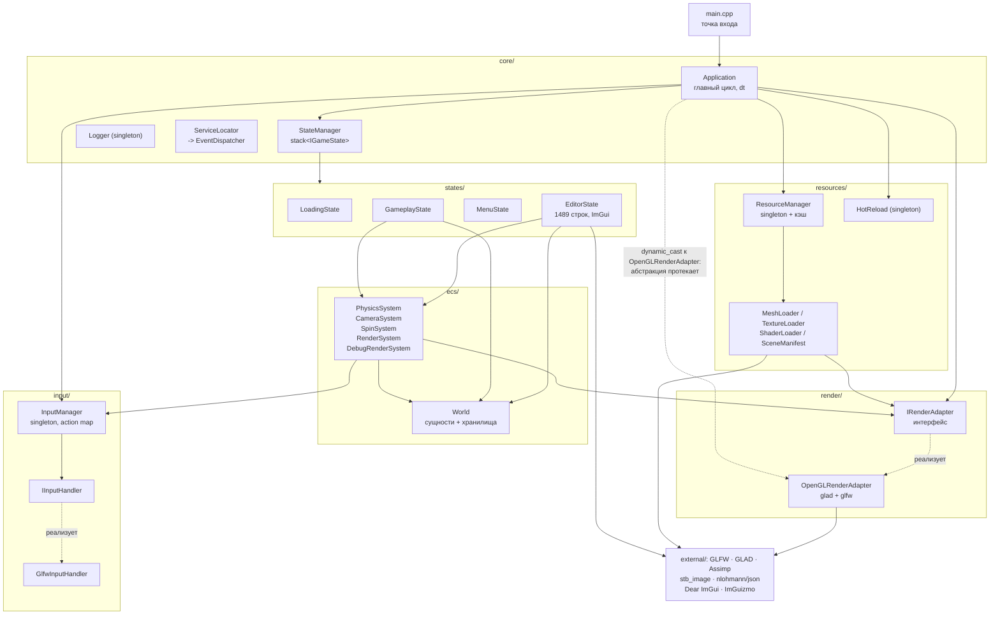
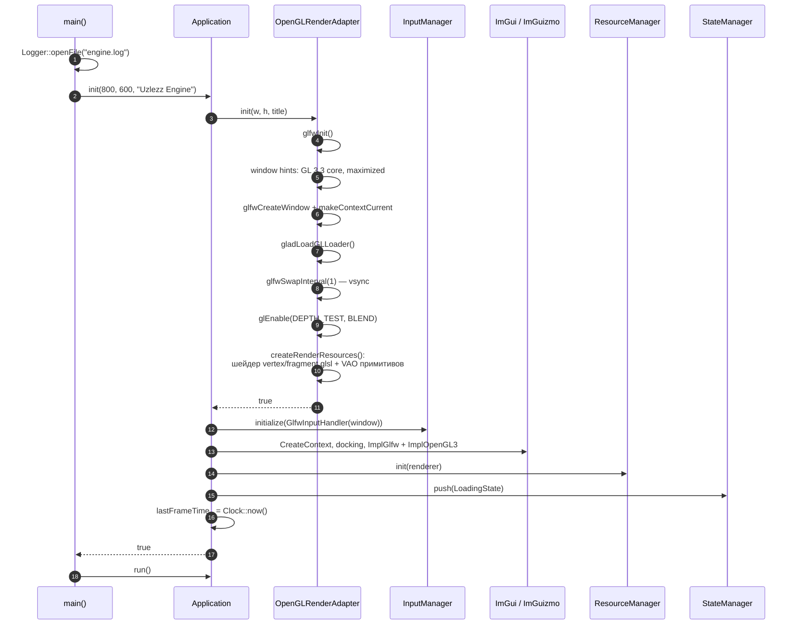
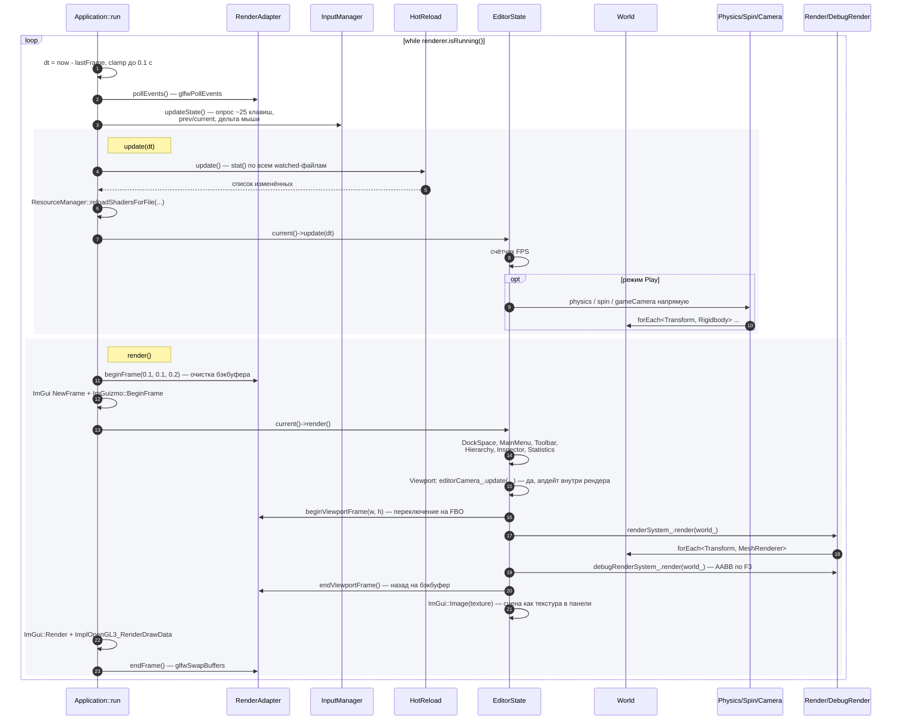
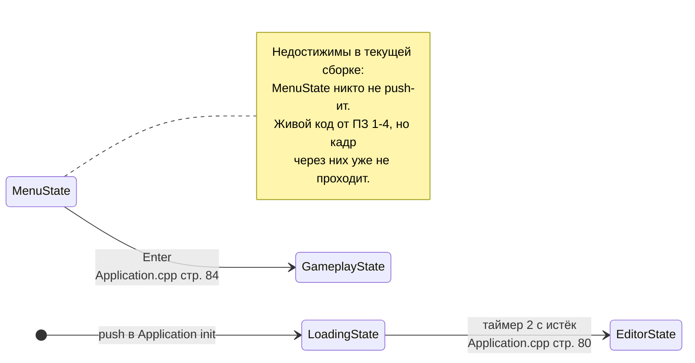
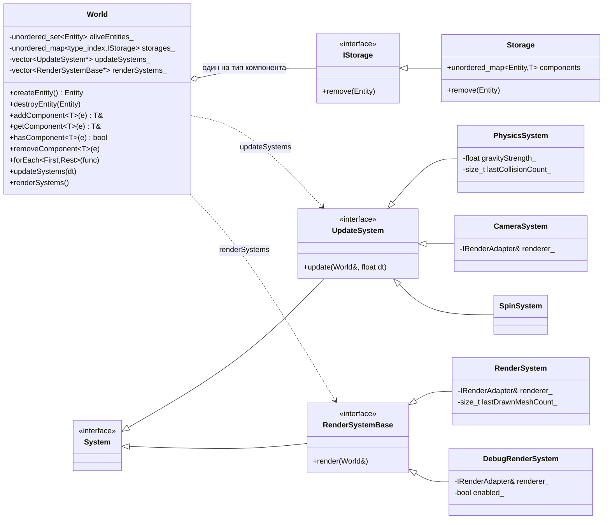
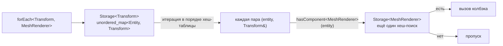
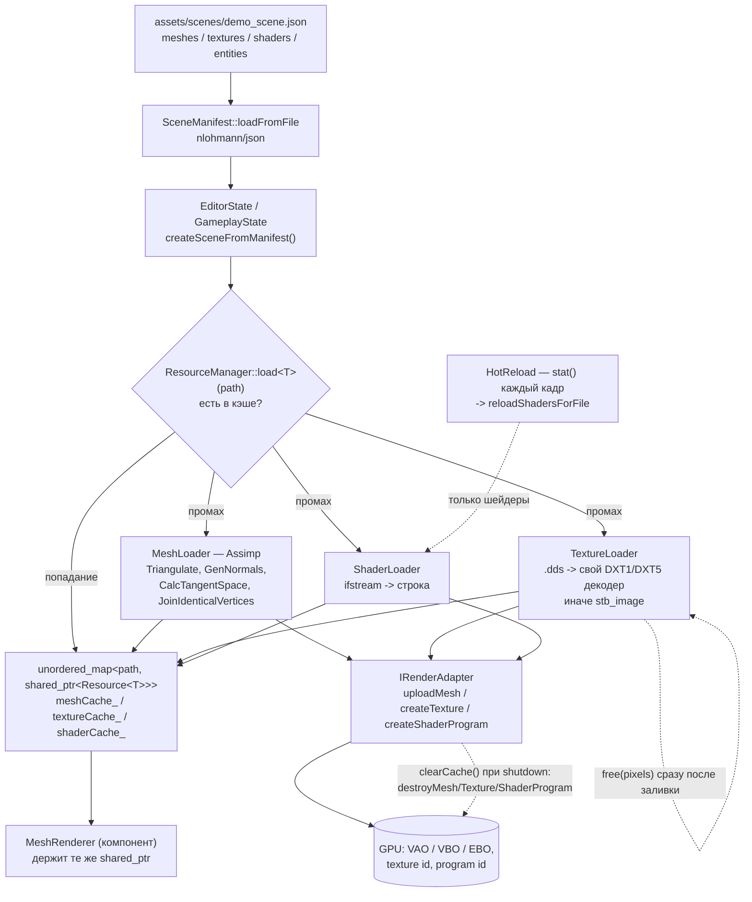
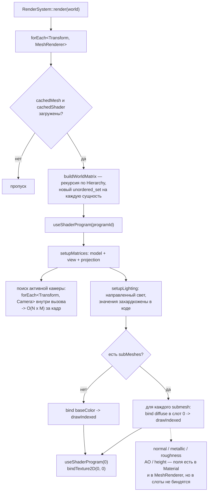

# Uzlezz Engine — архитектура

Схемы сгенерированы по коду ревизии `756bd6b` (ПЗ_5) и сверены с исходниками вручную.
Каждая диаграмма отражает то, что реально вызывается в текущей сборке.

- **Стек:** C++17, OpenGL 3.3 core, GLFW, GLAD, Assimp, stb_image, nlohmann/json, Dear ImGui + ImGuizmo, CMake
- **Объём:** ~6.8 тыс. строк в `src/`, 66 файлов, 8 внешних библиотек в `external/`
- **Точка входа:** [`src/main.cpp`](../src/main.cpp)

---

## 1. Модули и направление зависимостей

Единственный шов между движком и OpenGL — `IRenderAdapter`. Он держится всюду, кроме одного места:
`Application::init` делает `dynamic_cast<OpenGLRenderAdapter*>`, чтобы получить `GLFWwindow*` для ImGui
и для `GlfwInputHandler` ([`Application.cpp:26`](../src/core/Application.cpp), [`:118`](../src/core/Application.cpp)).

---

## 2. Инициализация

Порядок важен: контекст OpenGL создаётся первым, поэтому все дальнейшие загрузки ресурсов
могут сразу заливать данные на GPU. `ResourceManager` получает адаптер как «сырой» указатель
и хранит его до конца жизни процесса.

---

## 3. Один кадр — кто кого дёргает

Ключевая особенность: сцена рисуется **не в бэкбуфер, а в отдельный FBO**, и уже потом
попадает в кадр как текстура внутри ImGui-панели `Viewport`
([`EditorState.cpp:1239`](../src/states/EditorState.cpp), [`OpenGLRenderAdapter.cpp:96`](../src/render/OpenGLRenderAdapter.cpp)).

---

## 4. Состояния

Переходы жёстко прописаны в `Application::update` через `dynamic_cast` к конкретному типу
состояния — сами состояния запросить переход не могут.

---

## 5. ECS: модель данных

`Entity` — это просто `uint32_t`, наследования у игровых объектов нет вообще.
Компоненты — чистые структуры без методов, поведение целиком в системах:

| Компонент | Поля | Кто читает |
|---|---|---|
| `Transform` | `position`, `rotation` (углы Эйлера), `scale` | все системы |
| `MeshRenderer` | 8 строковых id + 8 `shared_ptr` на кэшированные ресурсы | `RenderSystem` |
| `Rigidbody` | `velocity`, `acceleration`, `mass`, `useGravity` | `PhysicsSystem` |
| `Collider` | `type` (Box/Sphere), `halfExtents`, `offset`, `radius` | `PhysicsSystem`, `DebugRenderSystem` |
| `Camera` | `fov`, `nearClip`, `farClip`, `aspectRatio`, `active`, `viewMatrix`, `projectionMatrix` | `CameraSystem`, `RenderSystem` |
| `Hierarchy` | `parent`, `children` | `RenderSystem`, `World::destroyEntity` |
| `Tag` | `name` | редактор, логи |
| `Spin` | `speed` | `SpinSystem` |

Допуск типа в ECS даёт `IsComponent<T>` + `static_assert`: контракт проверяется на этапе компиляции,
а не через наследование от базового класса.

**Как работает `forEach<A, B>`** — двухуровневый хеш-поиск:

Ни архетипов, ни SoA, ни плотных массивов: порядок обхода — это порядок бакетов
`unordered_map`, а на каждый дополнительный тип компонента приходится отдельный хеш-поиск.

---

## 6. Ресурсы: загрузка и владение

Всё синхронно, в главном потоке, во время `onEnter()` состояния. Владение двойное:
`shared_ptr` лежит и в кэше `ResourceManager`, и в компоненте `MeshRenderer` — то есть кэш
никогда не отдаёт память, пока жив процесс. GPU-хендл (`vao`, `textureId`, `programId`)
хранится **внутри** CPU-структуры данных ресурса, поэтому «данные» и «ресурс GPU» —
это один и тот же объект.

---

## 7. Отрисовка одного меша

Второй, независимый путь отрисовки — `drawPrimitive` / `drawDebugAABB` внутри самого адаптера:
у него свой `ShaderProgram shader_` (`assets/shaders/vertex.glsl` + `fragment.glsl`) и свои VAO
примитивов, созданные в `createRenderResources()`. Им пользуется только `DebugRenderSystem`.

---

## 8. Многопоточность

Её нет. `grep -r "std::thread|std::mutex|std::async|std::future|std::atomic" src/` не даёт ни одного
совпадения. Весь кадр — загрузка ресурсов, физика, обход ECS, вызовы OpenGL, ImGui — выполняется
в одном потоке. Синхронизация не нужна, потому что нечего синхронизировать.
