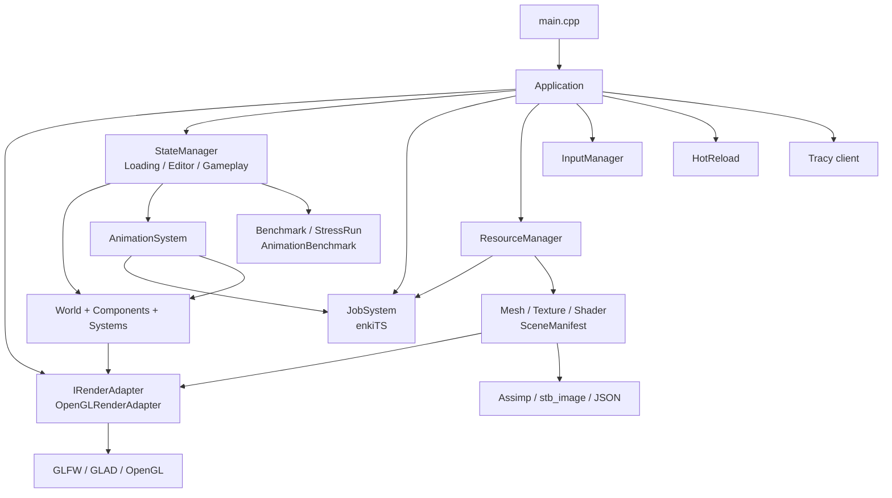
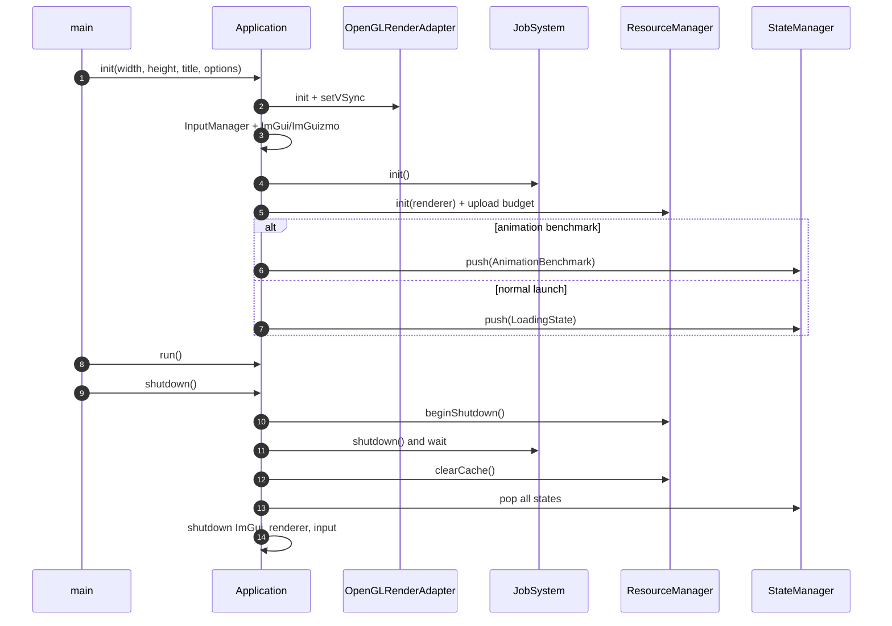
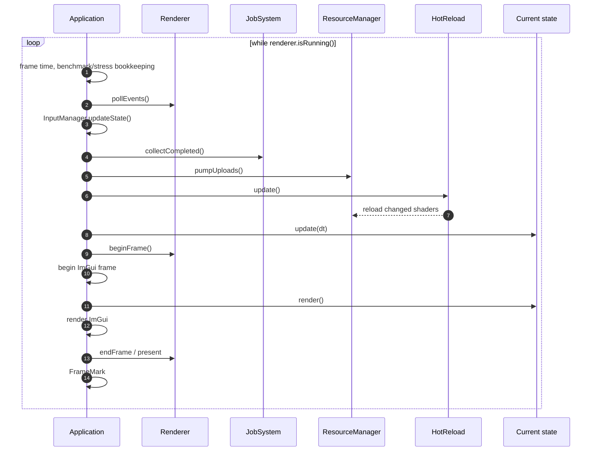
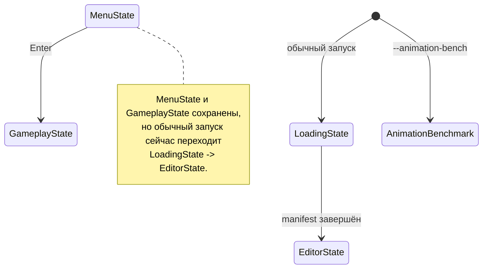
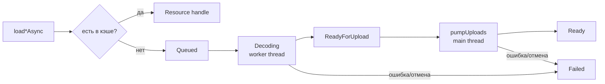

# Uzlezz Engine — актуальная архитектура

Документ обновлён 07.10.2026: ветка `feature/lab2-extras` на базе `9e476bf`.
Помимо ПЗ/ЛР 1 (Job System, ресурсы, Tracy, анимация) реализован скриптинг ЛР 2
на Lua с hot reload в Play и лимитами скриптов. Инструкция: [ЛР 2](lab2/README.md).

- **Стандарт:** C++17, CMake 3.16+
- **Графика и UI:** OpenGL 3.3 core, GLFW, GLAD, Dear ImGui, ImGuizmo
- **Контент:** Assimp, stb_image, nlohmann/json
- **Параллельность:** enkiTS 1.12
- **Профилирование:** Tracy 0.14.1
- **Скриптинг:** встроенный Lua 5.4.8, sol2 3.3.1
- **Точка входа:** [`src/main.cpp`](../src/main.cpp)
- **Главная цель сборки:** `GameEngine`

## 1. Модули и зависимости


```mermaid
flowchart TD
    Main["main.cpp"] --> App["Application"]

    App --> Renderer["IRenderAdapter<br/>OpenGLRenderAdapter"]
    App --> States["StateManager<br/>Loading / Editor / Gameplay"]
    App --> Jobs["JobSystem<br/>enkiTS"]
    App --> Resources["ResourceManager"]
    App --> Input["InputManager"]
    App --> HotReload["HotReload"]
    App --> Tracy["Tracy client"]

    States --> ECS["World + Components + Systems"]
    States --> Animation["AnimationSystem"]
    States --> Bench["Benchmark / StressRun<br/>AnimationBenchmark"]

    ECS --> Renderer
    Animation --> Jobs
    Animation --> ECS
    Resources --> Jobs
    Resources --> Loaders["Mesh / Texture / Shader<br/>SceneManifest"]
    Loaders --> Renderer
    Loaders --> External["Assimp / stb_image / JSON"]
    Renderer --> GL["GLFW / GLAD / OpenGL"]
```

`IRenderAdapter` отделяет большую часть движка от OpenGL. Платформенная граница
пока не полная: `Application` делает `dynamic_cast` к `OpenGLRenderAdapter`, чтобы
получить `GLFWwindow` для ImGui и `GlfwInputHandler`.

## 2. Инициализация и остановка


```mermaid
sequenceDiagram
    autonumber
    participant M as main
    participant A as Application
    participant R as OpenGLRenderAdapter
    participant J as JobSystem
    participant RM as ResourceManager
    participant S as StateManager

    M->>A: init(width, height, title, options)
    A->>R: init + setVSync
    A->>A: InputManager + ImGui/ImGuizmo
    A->>J: init()
    A->>RM: init(renderer) + upload budget
    alt animation benchmark
        A->>S: push(AnimationBenchmark)
    else normal launch
        A->>S: push(LoadingState)
    end
    M->>A: run()
    M->>A: shutdown()
    A->>RM: beginShutdown()
    A->>J: shutdown() and wait
    A->>RM: clearCache()
    A->>S: pop all states
    A->>A: shutdown ImGui, renderer, input
```

Порядок остановки является частью контракта. Сначала менеджер ресурсов перестаёт
принимать новые запросы, затем Job System дожидается воркеров, и только после этого
удаляются очередь финализации, кэши и OpenGL-объекты.

## 3. Главный цикл и кадр


```mermaid
sequenceDiagram
    autonumber
    participant A as Application
    participant R as Renderer
    participant J as JobSystem
    participant RM as ResourceManager
    participant HR as HotReload
    participant S as Current state

    loop while renderer.isRunning()
        A->>A: frame time, benchmark/stress bookkeeping
        A->>R: pollEvents()
        A->>A: InputManager.updateState()
        A->>J: collectCompleted()
        A->>RM: pumpUploads()
        A->>HR: update()
        HR-->>RM: reload changed shaders
        A->>S: update(dt)
        A->>R: beginFrame()
        A->>A: begin ImGui frame
        A->>S: render()
        A->>A: render ImGui
        A->>R: endFrame / present
        A->>A: FrameMark
    end
```

`dt` ограничивается сверху значением 0,1 с для симуляции. Бенчмарки получают
неограниченное реальное время предыдущего кадра. Tracy-зона `Frame` охватывает
весь цикл, а `FrameMark` ставится после present.

В редакторе сцена рендерится в отдельный framebuffer и показывается как текстура
в ImGui-панели `Viewport`. Обновление камеры редактора выполняется при построении
viewport, тогда как игровая камера является обычной ECS-системой.

## 4. Состояния приложения


```mermaid
stateDiagram-v2
    [*] --> LoadingState : обычный запуск
    LoadingState --> EditorState : manifest завершён
    [*] --> AnimationBenchmark : --animation-bench
    MenuState --> GameplayState : Enter

    note right of MenuState
        MenuState и GameplayState сохранены,
        но обычный запуск сейчас переходит
        LoadingState -> EditorState.
    end note
```

`LoadingState` асинхронно запрашивает `assets/scenes/demo_scene.json` и считает
работу законченной, когда ресурс перешёл из pending в `Ready` или `Failed`.
Переходы по-прежнему задаются в `Application::update` через тип текущего состояния.

## 5. ECS

`Entity` — числовой идентификатор. `World` хранит множество живых сущностей и
отдельный `unordered_map<Entity, T>` для каждого типа компонента. Архетипов,
плотных SoA-массивов и автоматического планировщика систем нет.

| Компонент | Назначение |
|---|---|
| `Transform` | позиция, углы Эйлера и масштаб |
| `Tag` | имя сущности |
| `MeshRenderer` | идентификаторы и хэндлы меша, материалов и шейдера |
| `Hierarchy` | родитель и дочерние сущности |
| `Spin` | скорость вращения |
| `Animator` | клип, время, скорость и вычисленная поза |
| `Camera` | параметры и матрицы активной камеры |
| `Rigidbody` | скорость, ускорение, масса и гравитация |
| `Collider` | Box или Sphere, размеры и смещение |

Системы:

- `PhysicsSystem` — интеграция и столкновения Box/Sphere;
- `CameraSystem` — игровая камера и матрицы;
- `SpinSystem` — вращение;
- `AnimationSystem` — последовательное или пакетное вычисление поз;
- `RenderSystem` — меши, материалы и skinning;
- `DebugRenderSystem` — визуализация Box/Sphere-коллайдеров.

`World::forEach<A, B>` перебирает хранилище первого компонента и делает хеш-поиск
остальных компонентов. Порядок обхода не стабилен и определяется `unordered_map`.

## 6. Job System

`JobSystem` — единственная точка постановки фоновой работы. Это singleton-обёртка
над enkiTS со следующими операциями:

- `submit` — обычная задача с приоритетом `High`, `Normal` или `Low`;
- `submitBackground` — закреплённая за воркером задача, которую главный поток не
  забирает во время ожидания; используется файловым вводом и декодированием;
- `wait` — ожидание с возможностью выполнять обычные задачи;
- `parallelFor` — синхронное разбиение диапазона;
- `collectCompleted` — удаление завершённых хэндлов раз в кадр;
- `shutdown` — ожидание всех задач, включая порождённые другими задачами.

Если система не запущена, `submit` выполняет функцию сразу. Это сохраняет
однопоточный контракт тестов и безопасное поведение после shutdown.

### Анимация

`AnimationSystem` сначала на главном потоке собирает готовые `MeshData` и
`Animator`, обновляет время и подготавливает размеры поз. Затем персонажи делятся
на пакеты `batchSize`; каждый пакет вычисляет только принадлежащие ему позы.
После ожидания всех пакетов рендер получает завершённые палитры костей.

Импорт поддерживает TRS-каналы, линейную интерполяцию векторов, quaternion SLERP,
до 128 костей на подмеш и четыре наибольших веса на вершину. OpenGL-вызовы и
передача матриц костей остаются на главном потоке.

## 7. Ресурсы


```mermaid
flowchart LR
    Request["load*Async"] --> Cache{"есть в кэше?"}
    Cache -->|да| Handle["Resource handle"]
    Cache -->|нет| Queue["Queued"]
    Queue --> Worker["Decoding<br/>worker thread"]
    Worker --> ReadyUpload["ReadyForUpload"]
    ReadyUpload --> Pump["pumpUploads<br/>main thread"]
    Pump --> Ready["Ready"]
    Worker -->|ошибка/отмена| Failed["Failed"]
    Pump -->|ошибка/отмена| Failed
```

Жизненный цикл `ResourceState`:

`Queued → Decoding → ReadyForUpload → Ready` либо `Failed`.

- сцена JSON читается и разбирается на воркере;
- меш Assimp и его анимация декодируются на воркере;
- PNG/JPG/DDS декодируются на воркере;
- OpenGL upload, компиляция шейдеров и публикация `Ready` выполняются на главном
  потоке;
- меш загружается по одному подмешу за шаг пампа;
- ожидающий меш отображается процедурным кубом, текстура — серой шахматкой;
- синхронные `loadMesh/loadTexture` оставлены для baseline, тестов и примитивов;
- шейдеры пока загружаются синхронно и могут hot-reload по изменению файла.

По умолчанию памп имеет бюджет 4 мс и максимум 8 операций на кадр. Первая операция
проходит всегда, потому что один вызов OpenGL нельзя безопасно прервать посередине.

## 8. Рендеринг

`RenderSystem` пропускает сущности без готового шейдера. Для загружаемого или
ошибочного меша он рисует placeholder; для загружаемой текстуры использует
шахматную заглушку. Для каждого подмеша выбирается diffuse/base-color текстура.
Остальные PBR-пути присутствуют в данных компонента, но текущий рендер их не
подключает.

Для анимированного меша система проверяет соответствие позы текущему `MeshData`,
передаёт `meshNodeTransform`, массив `boneMatrices[128]` и включает `useSkinning`.
Матрицы костей передаются обычным uniform-массивом, не через UBO/SSBO.

Сохраняются известные простые места архитектуры: активная камера ищется при
настройке матриц каждого меша, мировая матрица иерархии вычисляется рекурсивно,
а освещение задано константами в `RenderSystem`.

## 9. Tracy

Tracy client собирается из `external/tracy/public/TracyClient.cpp`. При
`ENGINE_ENABLE_TRACY=ON` инструментация активна только в `Release` и
`RelWithDebInfo`; определены `TRACY_ENABLE` и `TRACY_ON_DEMAND`.

Основные зоны и графики движка:

- `Frame`, `Input`, `Present`, `ImGui draw`;
- `Simulation`, `Physics`, `Scene render`, `Viewport`;
- `Resource upload pump`, `Load mesh/texture/shader`;
- `Animation update/prepare/dispatch/wait/poses`;
- графики `Jobs in flight`, `Loads pending`, `Animated characters`;
- имена потоков `Main` и `Job worker N`;
- зоны сна и ожидания enkiTS через profiler callbacks.

Пять отдельных Tracy-демо (`zones`, `locks`, `memory`, `messages`, `gpu`) строятся
на Windows при `ENGINE_BUILD_TRACY_DEMOS=ON`. Для захватов нужен profiler той же
версии 0.14.1.

## 10. Сборка, запуск и тесты

macOS (Homebrew: `brew install cmake glfw assimp`):

```bash
tools/setup_lua.sh
cmake -S . -B build/mac -DCMAKE_BUILD_TYPE=Release
cmake --build build/mac --parallel
ctest --test-dir build/mac --output-on-failure
./build/mac/GameEngine        # из корня репозитория: пути к assets относительные
```

Типичная Windows-сборка:

```powershell
powershell -ExecutionPolicy Bypass -File tools/setup_lua.ps1
cmake -S . -B build -A x64
cmake --build build --config Release
ctest --test-dir build -C Release --output-on-failure
```

Tracy включён по умолчанию. Отключение клиента:

```powershell
cmake -S . -B build -DENGINE_ENABLE_TRACY=OFF
```

Зарегистрированные CTest-наборы:

1. `AnimationTests`;
2. `WalkingAnimationTests` с реальным `Walking.fbx`;
3. `PhysicsSystemTests`;
4. `JobSystemTests`;
5. `CoordinateSystemTests`;
6. `TextureResourceTests`, включая OpenGL и GPU skinning;
7. `ScriptSystemTests`: Lua lifecycle, волны, импульс, ссылки, ошибки, reload и JSON;
8. `ScriptRuntimeTests`: файл:строка у ошибок биндингов, print, типы полей, лимиты
   времени и памяти, stubs для IDE, hot reload в Play (L1/L2), вотчер на job system;
9. `AssetDatabaseTests`, `EditorMathTests`: модель и математика редактора.

У `GameEngine` нет отдельного `--help`; актуальную строку синтаксиса печатает
запуск с неизвестным аргументом. Основные режимы: `--bench`, `--stress-seconds`,
`--upload-budget-ms` и `--animation-bench`.

Исторические измерения и воспроизводимые команды находятся в [`docs/lab1`](lab1/).

## 11. Текущие ограничения

- OpenGL и GPU-финализация строго однопоточны;
- одна крупная неделимая GPU-заливка может превысить бюджет пампа;
- `ResourceManager` и его публичные кэши предполагают вызовы с главного потока;
- шейдеры загружаются синхронно;
- ECS использует разреженные хеш-таблицы и не оптимизирован для cache locality;
- только base-color/diffuse материал участвует в текущем рендере;
- нет blending клипов, IK, retargeting, morph targets и извлечения root motion;
- `MenuState`/`GameplayState` не входят в обычный маршрут запуска редактора;
- переходы состояний связаны с конкретными типами через `dynamic_cast`.

## 12. ЛР 2: скриптинг и префабы

Каждый `ScriptSystem` владеет одним `sol::state`: создаёт его при создании
редактора, регистрирует API, затем освобождает в деструкторе после всех ссылок sol2.
Lua 5.4.8 собирается статически в exe; Python и отдельная DLL интерпретатора не нужны.
`ScriptSystem` в главном потоке вызывает виртуальные `ScriptBehaviour::on_create`,
`on_update`, `on_destroy`; адаптер `LuaBehaviour` перенаправляет их в защищённые
вызовы Lua. `uzlezz.behaviour {...}` создаёт Lua-прототип, расширяющий привязанную
C++-базу через метатаблицу; отдельная таблица хранит состояние каждого экземпляра.
ECS-компонент `ScriptComponent` хранит только путь, класс, источник префаба и
поля `bool/int/double/string`. Поэтому копирование и Play snapshot не копируют Lua VM.

Модуль `uzlezz` экспортирует Vec3, безопасный Entity handle и World API:
позиция/поворот/анимация/поля, input actions, поиск по тегу, spawn prefab,
отложенное destroy, строка игрового статуса. Handle проверяет weak lifetime
мира и поколение ID; остановленный World proxy не оживает при следующем Play.

`PrefabManager` создаёт сущность из JSON, поддерживает Transform, Tag,
MeshRenderer, Animator, Collider, Rigidbody, ScriptComponent. При ошибке
создание откатывается. Inspector сохраняет примитивные поля в исходный JSON
через временный файл и замену; остальные ключи сохраняются.

`EditorContext` владеет `ScriptSystem` и загружает демосцену; окно **Gameplay**
(`src/editor/panels/GameplayPanel`) открывает Arena, перезагружает скрипты
(в Edit — целиком, в Play — hot reload), показывает статус, ошибки Lua, кучу Lua
и время скриптов за кадр; карточка Script в Inspector редактирует поля. Stop уничтожает экземпляры скриптов, затем восстанавливает snapshot,
включая значения полей. Preview врага виден в Edit для настройки префаба и исключён из Play.

Скрипты `assets/scripts/{core,enemy,waves}.lua` содержат всю механику защиты
ядра. C++ не рассчитывает волны, урон, cooldown и условия поражения.
Ошибки Lua изолируют проблемный экземпляр: в UI первая строка с файл:строка,
в логе — со стеком. Исключения из C++-биндингов (неизвестное поле, протухший handle)
тоже получают место вызова: собственный exception handler sol2 добавляет `luaL_where`.
Reload загружает файл в свежее Lua environment и проверяет прототипы/типы полей до замены.
Поля компонента приводятся к объявлению класса: целое расширяется до number,
удалённое из Lua поле выбрасывается с предупреждением — reload от этого не падает.
Открыты только base/math/table/string без `dofile`/`loadfile`; `print` идёт в лог.

**Sandbox.** Куча Lua идёт через собственный аллокатор с потолком (256 МБ по умолчанию),
а count-хук раз в 1000 инструкций прерывает вызов, превысивший бюджет (100 мс).
Бесконечный цикл даёт ошибку с файл:строка цикла и отключает только этот экземпляр.

**Hot reload.** `ScriptWatcher` раз в 200 мс ставит фоновую задачу job system: обход
`assets/scripts` и файлов сцены, метка `last_write_time` + размер, debounce на два опроса,
чтение и проверка синтаксиса в одноразовом `lua_State`. Главный поток забирает результат
и вызывает `ScriptSystem::hotReload(path, source, mode)`: классы файла собираются и
проверяются целиком, при ошибке работает прежний код. В Play каждый экземпляр получает
новый объект и `on_create`; режим L2 переносит `self.*` с тем же типом, кроме полей, чьё
начальное значение после `on_create` изменилось в коде; класс может взять перенос на себя
через `on_reload(old)`. Режим L1 оставляет состояние из `on_create`. Отключённые ошибкой
экземпляры оживают с исправленным кодом.

**Профилирование.** Зоны Tracy `Lua: update`, `Lua: reload`, `Lua: hot reload`, по зоне
на каждый entry point с именем `Класс:метод`, зоны вотчера на воркере; графики
`Lua memory KB` и `Lua instances`.

**IDE.** `tools/lua-stubs/uzlezz.lua` — аннотации lua-language-server (`.luarc.json`);
`ScriptRuntimeTests` сверяет их с метатаблицами usertype через `ScriptSystem::apiNames()`.
