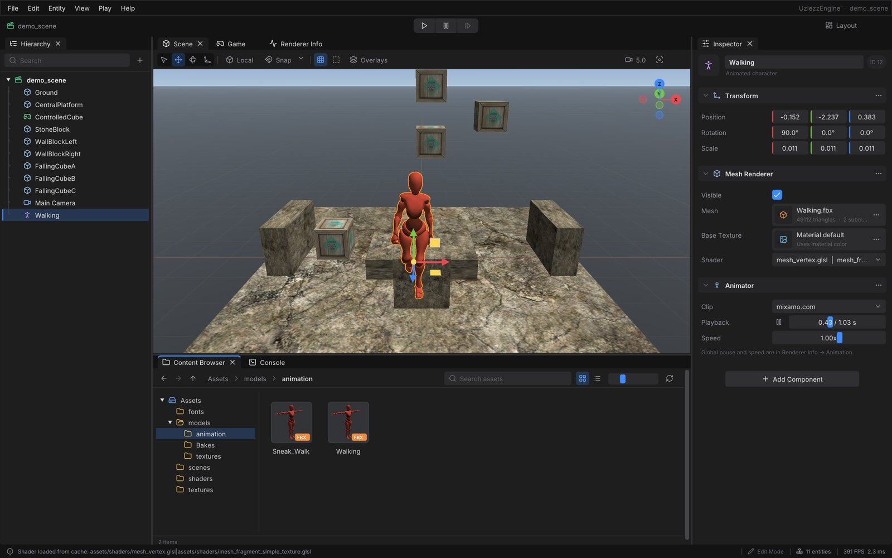

# Редактор UzlezzEngine



Интерфейс в духе Unity поверх Dear ImGui (docking). Тема — графит с синим акцентом,
шрифты Inter и JetBrains Mono, иконки Lucide (`assets/fonts`, лицензии рядом).

## Окна

| Окно | Что умеет |
|---|---|
| **Hierarchy** | Дерево сущностей с иконками по типу, поиск, создание (`+`, ПКМ), переименование на месте (F2), перетаскивание для смены родителя (мировая позиция сохраняется), глаз видимости |
| **Inspector** | Карточки компонентов с меню «…» (Reset, Remove), Vec3 с цветными осями X/Y/Z, ПКМ по подписи — сброс; слоты меша и текстуры принимают ассеты из Content Browser; Add Component с поиском. Для выбранного ассета — превью текстуры; у моделей и материалов живой 3D-вид (перетаскивание — орбита, колесо — зум, двойной клик — сброс, персонажи анимируются), материалы, клипы; исходник шейдера/JSON/Lua с подсветкой (у Lua — кнопки Edit Script и Open Externally). Карточка Script: поля Lua-класса, Edit Script, Save to Prefab, Reload Scripts |
| **Scene** | Инструменты Q/W/E/R, Local/Global (X), снап с шагами, сетка на полу сцены, небо, контур выделения, оверлеи коллайдеров и камер, гизмо осей (клик — вид вдоль оси), скорость камеры. Модель из Content Browser появляется в сцене уже при наведении и едет за курсором, отпускание оставляет её (как в UE5); текстура или материал подсвечивают объект под курсором и ложатся на него; префаб ставится в точку бросания; сцена — открывается |
| **Game** | Вид из Main Camera в отдельную цель рендера, пресеты Free / 16:9 / 16:10 / 4:3 / 1920×1080 / 1280×720 / портрет, статистика, HUD Lua-игры |
| **Renderer Info** | FPS, время кадра с графиком, ресурсы и GPU-текстуры; инструменты ЛР 1: толпа с анимацией, тяжёлая загрузка, стресс |
| **Gameplay** | ЛР 2: сцена Arena, Reload Scripts, статус Lua-игры плитками (HP ядра, волна, враги), ошибки Lua, управление, список сущностей со скриптами. В Play статус дублируется HUD-ом поверх Game |
| **Script Editor** | Правка Lua прямо в редакторе: вкладки, подсветка, номера строк, Tab / Shift+Tab (в том числе по выделенным строкам), отступ после Enter (`then`, `do`, `function(...)`, `{`), проверка синтаксиса на лету (ошибка со строкой над текстом, красная метка в поле, клик — переход к строке). Ctrl+S пишет файл, и тот же вотчер, что следит за внешним редактором, применяет скрипт к игре: в Edit и в Play. Открывается двойным кликом по `.lua` в Content Browser, кнопкой **Edit Script** в Inspector (у ассета и в карточке Script) или **Go to line** у ошибки Lua в Gameplay. **Open Externally** по-прежнему открывает файл во внешнем редакторе; правки, сделанные снаружи, подтягиваются в буфер, а если в буфере есть несохранённое — предлагается выбрать версию. Формат файла (CRLF, BOM, отступы табами) при сохранении сохраняется. При закрытии вкладки или окна с несохранённым спрашивает |
| **Content Browser** | Дерево папок, карточки в стиле UE5: рендер моделей в ракурсе 3/4, материалы (.mtl) шаром со своей текстурой, превью текстур, цветная полоса типа, имя в две строки и тип; крошки, назад/вперёд/вверх, поиск по проекту, список с размером и датой, размер плиток (Ctrl/⌘ + колесо), контекстное меню: открыть, показать в Finder/Проводнике, скопировать путь, перезагрузить шейдер |
| **Console** | История Logger, фильтры Info/Warning/Error со счётчиками, поиск, схлопывание повторов, детали записи и копирование |

Сверху — меню и Play / Pause / Step, снизу — статус-бар: последнее сообщение лога
(клик открывает консоль), загрузки, режим, число сущностей, FPS. В Play статус-бар синий.

Раскладка и настройки (масштаб UI, фильтры, снап, размер плиток…) сохраняются в
`editor_layout.ini` рядом с исполняемым файлом. View → Reset Layout возвращает раскладку.

## Управление

| Клавиши | Действие |
|---|---|
| ПКМ + WASD, Q/E | Полёт камеры сцены, вниз/вверх; Shift — быстрее |
| Alt + ЛКМ / СКМ / колесо | Облёт / панорама / зум |
| F | Показать выделенное |
| Q / W / E / R | Выбор / перемещение / поворот / масштаб |
| X | Локальные / глобальные ручки |
| Ctrl при перетаскивании | Инвертировать снап |
| Ctrl+D, F2, Del | Дублировать, переименовать, удалить |
| Ctrl+P / Ctrl+Shift+P / Ctrl+Alt+P | Play-Stop / пауза / шаг кадра |
| Ctrl+R | Перечитать ассеты |
| Ctrl+S | Сохранить изменённые Lua-скрипты (Script Editor) |
| Tab / Shift+Tab (в Script Editor) | Отступ / убрать отступ у строки или выделенных строк |
| Space / F (в Play, окно Game в фокусе) | Арена: следующая волна / защитный импульс |

На macOS вместо Ctrl — ⌘. В Play клавиатуру получает игра, пока окно Game в фокусе.

## Скриншоты и сценарии без окна

Для проверки интерфейса редактор умеет работать со скрытым окном и сохранять кадр:

```
./GameEngine --editor-screenshot out.png [--editor-frames 120] [--window-size 1600x1000]
             [--editor-select Ground] [--editor-asset assets/textures/stone.dds]
             [--editor-browse assets/models] [--editor-open-script assets/scripts/enemy.lua] [--editor-tab game] [--editor-arena] [--editor-play]
             [--editor-colliders] [--editor-list-view] [--editor-reset-layout]
             [--editor-ini layout.ini]   # по умолчанию раскладка в этом режиме не сохраняется
```

`--editor-script файл` подаёт ввод по кадрам и снимает промежуточные кадры:

```
10 click 250 108          # навести, нажать и отпустить (в точках окна)
16 shot shots/create.png
18 key Escape
30 move 522 760           # перетаскивание: move / down / move… / up
34 down 0
40 move 756 512
44 up 0
50 key ctrl+D             # ctrl — модификатор платформы (⌘ на macOS)
52 text Новое имя
60 quit
```

## Устройство

- `src/editor/EditorContext` — модель редактора: мир, выделение, Play/Pause/Step,
  снимок сцены, команды (создать, дублировать, удалить, перецепить), рендер Scene/Game,
  перетаскивание модели в сцену с живым превью.
- `src/editor/AssetPreview` — миниатюры и живой вид моделей и материалов (свой мир с камерой,
  рендер во внеэкранную цель, копия в текстуру с мипмапами); разбор .mtl.
- `src/editor/panels/*` — окна. Общие контролы — `EditorWidgets`, палитра и шрифты — `EditorTheme`.
- `src/editor/AssetDatabase` — дерево файлов без ImGui (тесты: `tests/AssetDatabaseTests.cpp`).
- `src/editor/ScriptText` — текст скрипта без ImGui: перевод строк, BOM и табы туда и обратно, разбор «файл.lua:12:» из ошибок Lua,
  отступы для Tab и Enter (тесты: `tests/ScriptTextTests.cpp`). `src/editor/panels/ScriptEditorPanel` — окно поверх него:
  `InputTextMultiline` с прозрачным текстом, подсветка и номера строк рисуются поверх в окне самого поля, с его же прокруткой.
- `src/states/EditorState` — меню, тулбар, статус-бар, док, горячие клавиши, настройки.
- Lua и префабы (ЛР 2): `ScriptSystem` и `PrefabManager` живут в `EditorContext` — Play запускает
  скрипты (при ошибке Play отменяется и сцена восстанавливается), Stop их останавливает; снимок
  сцены и дублирование копируют `ScriptComponent`. JSON из `assets/prefabs` в Content Browser — тип Prefab.
- Рендер: несколько внеэкранных целей вьюпорта, сетка, небо и контур выделения в
  `OpenGLRenderAdapter`; маска выделения рисуется через `RenderSystem::renderMask`.

## Оси и повороты

Мир движка Z-up: X — вправо, −Y — вперёд, Z — вверх; кольца гизмо — красное X, зелёное Y, синее Z.
Импортированные модели (FBX, glTF) приходят в Y-up — их в Z-up поворачивает сам меш
(«Y-Up Source» в Mesh Renderer), поэтому у стоящей модели поворот (0, 0, 0) и оси как у остального мира.
Гизмо поворота записывает в трансформ итоговую матрицу, разложенную в порядке движка (Z·Y·X:
сначала наклон X/Y, рысканье Z последним — персонаж с X = 90° при любом Z стоит прямо),
так что кольцо всегда крутит вокруг своей оси; углы в инспекторе для сложных поворотов могут
выглядеть непривычно — это та же ориентация в эйлеровой записи движка.

## Ограничения

- Нет Undo/Redo и сохранения сцены в JSON.
- Физика и коллайдеры считают трансформ дочерней сущности мировым — смена родителя
  влияет на отрисовку, выбор и гизмо, но не на физику.
- ASCII-PPM движок не декодирует, поэтому у них нет превью.
- Сборка проверена на macOS; под Windows пути и вызовы переносимые, но не собирались.
