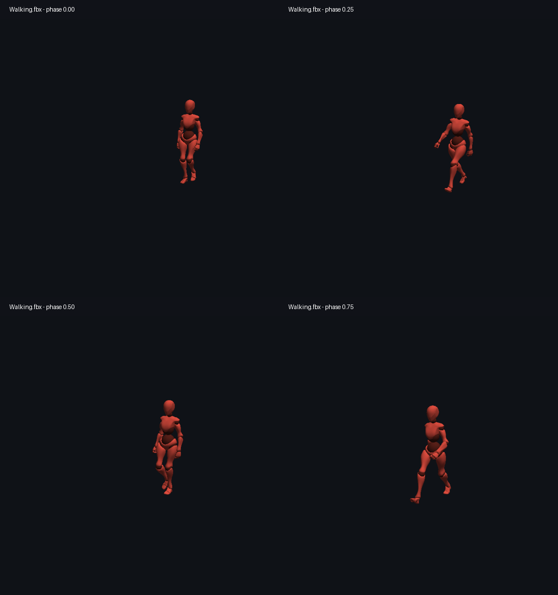

# Скелетная анимация и Job System

Включена предоставленная пользователем модель `assets/models/animation/Walking.fbx`.
Проверены импорт, четыре отрисованные позы, соответствие CPU/GPU skinning и
совпадение последовательного/параллельного вычисления для 512 персонажей.

Модель: 2 подмеша, 28 464 импортированные вершины, 49 112 треугольников,
65/64 костей в подмешах, 68 узлов после сворачивания FBX pivot helpers.
Клип `mixamo.com`: 1,03333 с, 51 анимированный узел, 3 873 TRS-ключа.
Ссылок на текстуры нет; отображаются исходные цвета материалов.
В клипе записано движение вперёд: при зацикливании персонаж возвращается
к началу траектории. Перенос этого движения в Transform/root motion не реализован.



## Подготовка модели

Предпочтительный формат — **glTF 2.0 Separate**: `.gltf`, соответствующий `.bin`
и внешние PNG/JPG-текстуры в одной папке с сохранением относительных путей.
Нужны меш, скелет, веса вершин и хотя бы один запечённый анимационный клип.
Для первой проверки достаточно одного персонажа и одного циклического клипа
(idle/walk). Модель в исходной bind/rest pose; анимация должна быть включена в экспорт.

Поддерживаются position/rotation/scale каналы узлов: линейная интерполяция
векторов и кратчайший quaternion SLERP для вращений. Экспортировать ключи
как запечённые TRS с линейной интерполяцией; constraints/IK должны быть запечены.
128 костей на подмеш, четыре наибольших веса на вершину с нормализацией.
Желательны уникальные имена узлов. Morph targets, смешивание клипов, IK,
root motion extraction и retargeting не реализованы. Движение корневой кости
остаётся частью позы. Встроенные в GLB текстуры старый загрузчик материалов
не извлекает — поэтому для новых моделей рекомендуется Separate. FBX проверен
на Walking.fbx; конкретные другие FBX/GLB требуют проверки после импорта.

## Запуск демо

1. Собрать Release, включая CopyAssets. Walking.fbx копируется вместе с assets.
2. Запустить Release `GameEngine.exe`, открыть **Statistics → Animation (lab 1)**.
3. В Model path уже выбран `assets/models/animation/Walking.fbx`. Выбрать число
   персонажей (1–2048; по умолчанию 16), нажать
   **Load / rebuild crowd**. Старая сцена сохраняется, заменяются только
   ранее созданные экземпляры толпы. Импорт модели выполняется в фоне через Job System;
   пока он идёт, панель показывает Loading model in background.
4. Для Walking.fbx и glTF оставить **Model uses Y up**: экземпляры поворачиваются в систему
   движка Z-up. Персонаж автоматически приводится к высоте 2 единицы в bind pose.
5. Камера фокусируется на толпе. У экземпляров разные начальные фазы клипа.
6. **Parallel poses** переключает последовательный/параллельный режим одного
   алгоритма. **Characters per job** — размер пакета. Есть общие пауза/скорость.
7. В Inspector выбранного персонажа доступны клип, пауза, скорость и время.
   Анимация работает и в Edit (preview), и в Play. Stop восстанавливает Animator
   вместе со снимком сцены. Дублирование копирует независимое состояние Animator.

## Зависимости и потоки

На главном потоке собирается массив ссылок на готовые MeshData и Animator;
подготавливаются размеры выходных буферов и время воспроизведения. До окончания
задач ECS и ресурсы не изменяются. Клипы, skeleton и inverse bind matrices
общие и только читаются. Каждая задача пишет в отдельные позы своих персонажей.
Внутри скелета порядок parent-before-child; разные персонажи независимы.

Последовательный режим проходит тот же массив тем же evaluator. Параллельный
ставит пакеты через JobSystem с высоким приоритетом. Главный поток ждёт все
пакеты (enkiTS может выполнять работу на ожидающем потоке), затем передаёт
палитры матриц в OpenGL UBO и рисует меши. Вершинный шейдер выполняет skinning.
Сами OpenGL-вызовы остаются на главном потоке. Задачи не переживают update.

## Проверка соответствия ЛР 1

Добавление новой системы анимации в качестве второй задачи согласовано
с преподавателем (подтверждено пользователем 24.09.2026).
Полный кадр Release, p50/p95/p99, три прогона, реальные Tracy-захваты и
проверки выхода с активной загрузкой: [отчёт](acceptance/README.md).
Ниже сохранён ранний CPU-only замер; он не заменяет измерение полного кадра.

## Tracy и проверка

- `Animation update` — полное CPU-время с подготовкой, постановкой и ожиданием;
- `Animation prepare` — сбор данных и подготовка буферов;
- `Animation dispatch` — постановка пакетов;
- `Animation poses` — вычисление пакета целиком, без зон на каждую кость;
- `Animation wait` — ожидание, включая полезную работу главного потока;
- `Skin palette upload and scene draws` — отправка матриц и отрисовка всей сцены.
  Это CPU-зона и она включает draw calls; она **не измеряет GPU-время**.

Сравнивать оба режима на одном числе персонажей/клипов, отдельно CPU animation
и полный кадр. Исключать загрузку модели и первые кадры с выделением буферов.
Менять количество персонажей и размер пакета. Ускорение не гарантируется:
маленькие нагрузки могут проигрывать постановке задач, большие — упираться в
GPU/число draw calls. Никаких искусственных задержек в evaluator нет.

`AnimationTests` проверяет quaternion SLERP, матрицы, иерархию, inverse bind,
зацикливание, импорт glTF, совпадение поз 257 экземпляров в обоих режимах
при разных размерах пакета, паузу, удаление сущностей и выключенный scheduler.
Технический glTF-fixture (один треугольник и две кости) создаётся в build,
не является демонстрационной моделью. `TextureResourceTests` дополнительно
проверяет реальный GPU skinning через transform feedback и статический рендер.

Windows: `ctest --test-dir build -C Release --output-on-failure`.

### Проверка реального FBX и замер 24.09.2026

Windows, Ryzen 7 7800X3D, MSVC Release. 512 экземпляров Walking.fbx, 4 рабочих
потока enkiTS плюс главный поток (он помогает при ожидании), пакет 32 персонажа.
Три прогона каждого режима по 180 измеряемых обновлений, перед каждым 30 прогревочных;
порядок режимов чередуется. Фазы клипа одинаковы в обоих режимах. Tracy выключен
в тестовом исполняемом файле. Импорт и рендеринг в этот замер не входят.

| CPU update | Среднее по каждому прогону, мс | Медиана средних, мс |
|---|---|---|
| Последовательно | 3,614 / 3,643 / 3,668 | 3,643 |
| Job System | 0,904 / 0,908 / 0,908 | 0,908 |

В этом измерении CPU update ускорился примерно в 4 раза. Это не увеличение FPS
в 4 раза: отрисовка 512 копий этой модели означает около 25 млн треугольников
за кадр и может стать главным ограничением. Время включает подготовку данных,
постановку задач и ожидание; данные: [walking-cpu-win.csv](walking-cpu-win.csv).

Повторить из корня репозитория:

```powershell
.\build\Release\AnimationTests.exe build/walking-test-fixtures assets/models/animation/Walking.fbx --benchmark
```

CSV появляется в `build/walking-test-fixtures/walking-cpu.csv`.
`WalkingAnimationTests` в CTest проверяет реальные позы, границы тела и зацикливание.
В `TextureResourceTests` transform feedback сравнивает позиции всех треугольников
FBX с CPU-формулой skinning в четырёх фазах; кадры сохраняются в
`build/texture-test-fixtures/Walking_phase_*.ppm` для визуальной проверки.

Регрессия FBX: `AI_CONFIG_IMPORT_FBX_PRESERVE_PIVOTS=false` согласует локальные
TRS узлов с каналами анимации. С прежними pivot helper nodes у этой модели
смещения применялись повторно: ноги поднимались примерно на 188 исходных единиц.
Проверка границ стоящего персонажа ловит эту ошибку независимо от совпадения CPU/GPU.
